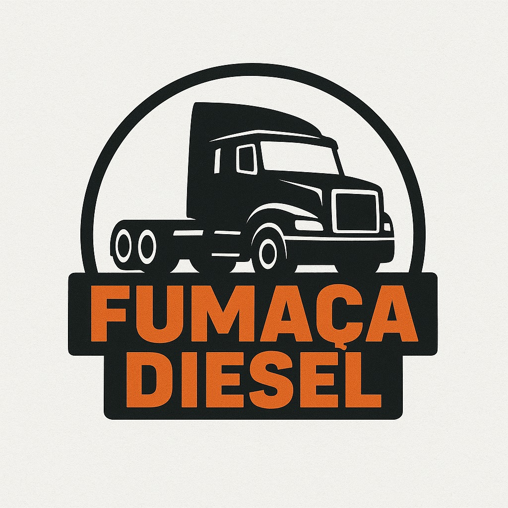

<div align="center">
   
</div>

# 🚛 FumacaDiesel APP

<div align="center">
   <b>Gerencie manutenções de caminhões de forma simples, rápida e eficiente.</b>
</div>

---

## 📋 Sobre o Projeto

O **FumacaDiesel APP** é um aplicativo móvel focado no gerenciamento de serviços de manutenção de caminhões. Ideal para oficinas e empresas de transporte que desejam manter o controle e o histórico de suas manutenções de maneira centralizada e intuitiva.

---

## 📱 Funcionalidades

- 🔍 **Busca de veículos** por placa
- 🚛 **Visualização detalhada** das informações do caminhão
- 📊 **Histórico completo** de serviços realizados
- ➕ **Adição e gerenciamento** de novos serviços
- 🔧 **Controle de manutenções** preventivas e corretivas

---

## 🚀 Tecnologias Utilizadas

- [React Native](https://reactnative.dev/) & [Expo](https://expo.dev/) — Desenvolvimento mobile multiplataforma
- [TypeScript](https://www.typescriptlang.org/) — Tipagem estática
- [React Navigation](https://reactnavigation.org/) — Navegação entre telas
- [Expo Router](https://docs.expo.dev/router/introduction/) — Sistema de rotas

---

## 🗂️ Estrutura de Pastas

```
FumacaDieselAPP/
├── app/           # Rotas e telas principais (index.tsx, modals, etc.)
│   └── service/   # Serviços específicos de rotas
├── assets/        # Imagens, fontes, ícones
├── components/    # Componentes reutilizáveis (inputs, botões, etc.)
├── constants/     # Cores, estilos e configurações globais
├── mocks/         # Dados mockados para testes
├── screens/       # Telas principais (home, serviços, etc.)
├── services/      # (Futuro) Integração com API/backend
└── types/         # Tipagens TypeScript (ex: Veiculo, Servico)
```

---

## 💻 Pré-requisitos

- [Node.js](https://nodejs.org/en/) (v14+)
- [npm](https://www.npmjs.com/) ou [yarn](https://yarnpkg.com/)
- [Expo CLI](https://docs.expo.dev/workflow/expo-cli/)

---

## 🔧 Instalação e Execução

1. **Clone o repositório:**
    ```bash
    git clone https://github.com/henriquecampaner/app-fuma-diesel.git
    cd FumacaDieselAPP
    ```

2. **Instale as dependências:**
    ```bash
    npm install
    # ou
    yarn install
    ```

3. **Inicie o projeto:**
    ```bash
    npx expo start
    ```
    Siga as instruções do terminal para rodar no emulador ou dispositivo físico.

---

## 🙋‍♂️ Contato

Desenvolvido por [Henrique Camargo](https://github.com/HenriqueCamarg0).

---